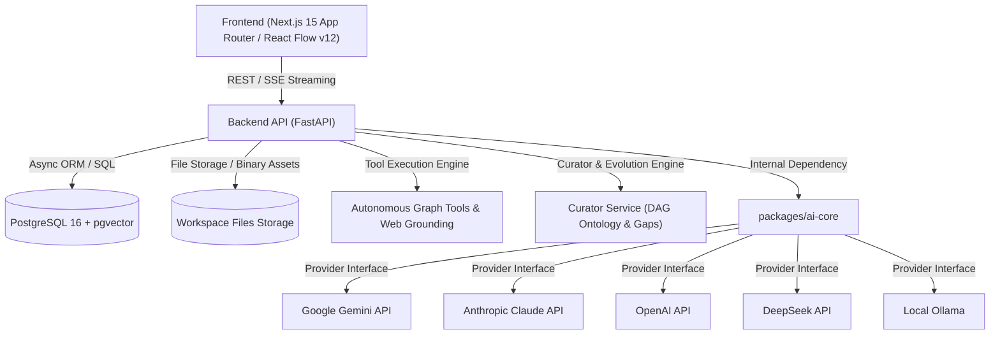
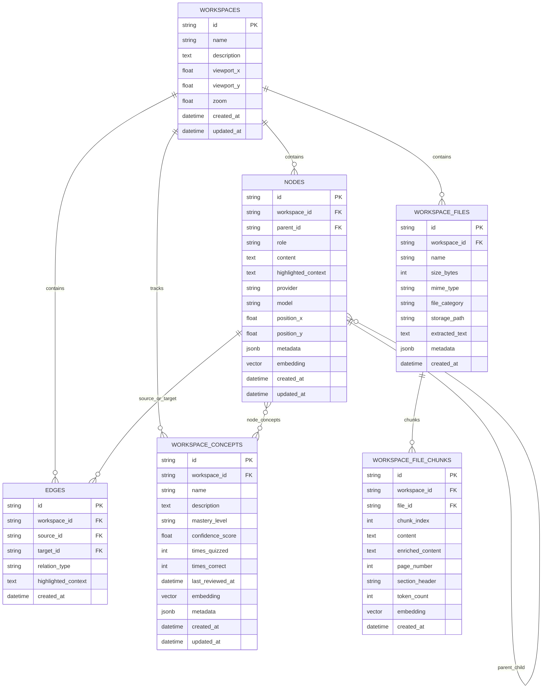
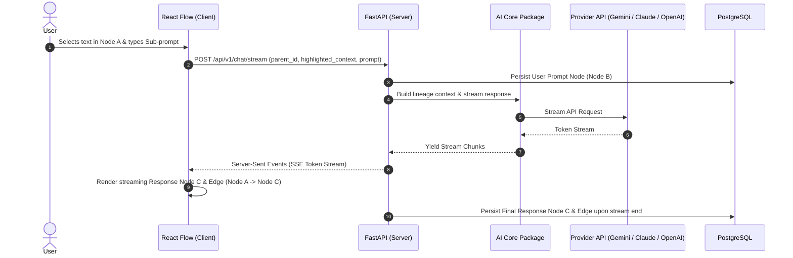
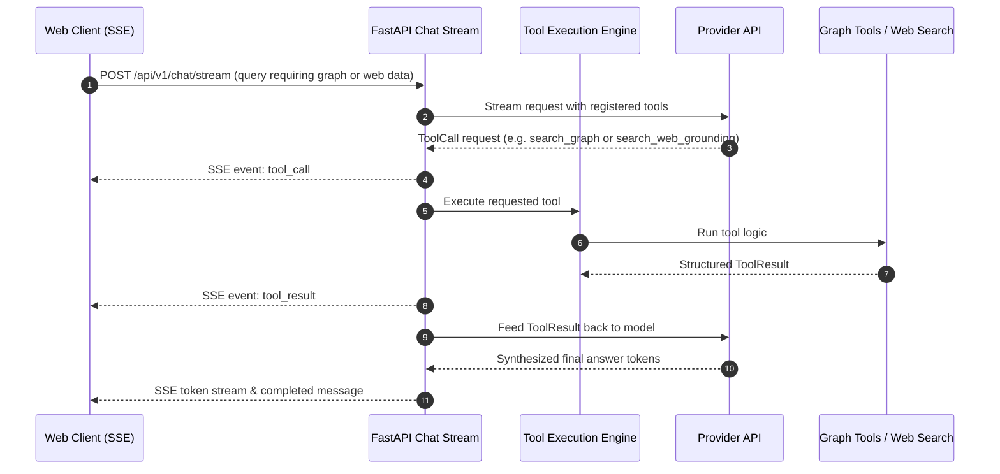
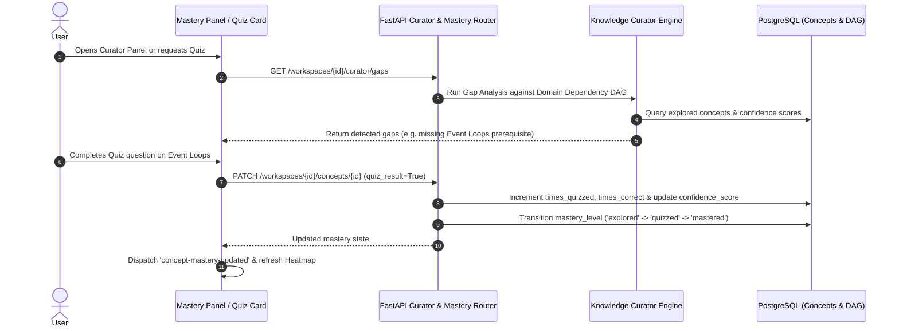

# System Architecture — GraphMind

---

## 1. Architectural Principles & Overview

GraphMind is designed as a **Modular Monolith** housed within a monorepo. It prioritizes simplicity, clean separation of concerns, high observability, strict interface boundaries, and progressive knowledge evolution.



---

## 2. Monorepo Repository Structure

```
GraphMind/
├── apps/
│   ├── web/                    # Next.js 15 App Router Frontend (TypeScript, React Flow, Zustand)
│   │   ├── src/app/            # Canonical routes: /w/[workspaceId]/chat/[chatId] and /canvas
│   │   ├── src/components/     # Canvas, Chat, PDF/Code/Table Modals, UI library
│   │   └── src/store/          # Zustand client stores (chat, canvas, settings)
│   └── api/                    # FastAPI Backend (Python 3.12+, uv package manager)
│       ├── skills/             # Declarative system skills (Code Architect, Deep Research, Quiz Master)
│       └── src/
│           ├── routers/        # FastAPI endpoints: workspaces, chat, files, mastery, curator
│           ├── services/       # Tool engine, graph tools, file parsing, semantic search, curator
│           └── models/         # SQLAlchemy ORM models (Workspace, Node, Edge, File, Chunk, Concept)
├── packages/
│   ├── ai-core/                # Provider-agnostic LLM, embedding, tool, and skill abstractions
│   └── shared/                 # Shared TypeScript types, schemas, and API contracts
├── docs/                       # System documentation, PRD, Manifesto, ADRs, Roadmap
├── docker-compose.yml          # PostgreSQL 16 (pgvector), Redis, and service containerization
├── pnpm-workspace.yaml         # Workspace configuration for JS/TS packages
├── pyproject.toml              # Python root workspace configuration (uv)
└── README.md
```

---

## 3. Component Details & Technology Stack

### 3.1 Frontend (`apps/web`)
- **Framework**: Next.js 15 (App Router with canonical URL hierarchy `/w/[workspaceId]/chat/[chatId]`).
- **Language**: TypeScript (strict mode enabled).
- **State Management**:
  - `Zustand`: Client-side state (canvas graph nodes, active selection, viewport, active tools).
- **Graph Visualization**: `React Flow` (`@xyflow/react` v12) for 2D canvas, custom nodes (`ThreadGraphNode`), custom bezier/mindmap edges (`MindMapEdge`), Dagre hierarchical auto-layout, and Timeline Replay scrubber.
- **Multimodal Viewers**:
  - `PdfViewerModal`: In-page multi-page PDF reader.
  - `CodeViewerModal`: Syntax-highlighted code viewer.
  - `TableViewerModal`: Interactive tabular grid for CSV, TSV, JSONL, and Excel (`.xlsx`) datasets.
- **Mastery Overlays**:
  - `MasteryPanel`: Interactive sheet presenting concept mastery progress, detected knowledge gaps, and next best topic recommendations.
  - `Heatmap Overlay`: Real-time node illumination based on user mastery levels (`mastered`, `quizzed`, `explored`, `stale`).
- **Styling & UI**: Tailwind CSS v4 + `shadcn/ui` (Radix primitives), minimal clean aesthetic.
- **Markdown & Math**: `react-markdown`, `remark-gfm`, `remark-math`, `rehype-katex` (KaTeX), `rehype-highlight`.

### 3.2 Backend (`apps/api`)
- **Language**: Python 3.12+ (managed with `uv`).
- **Framework**: FastAPI (async routes, automatic OpenAPI documentation, Pydantic v2 validation).
- **Database & ORM**: SQLAlchemy 2.0 (asyncpg) with composite indices for sub-10ms queries.
- **Database Engine**: PostgreSQL 16 with `pgvector` extension (HNSW vector indices for dense embeddings).
- **Hybrid RAG Engine**: Dual retrieval combining dense vector similarity with PostgreSQL full-text search (`to_tsvector` / GIN index) and Reciprocal Rank Fusion (RRF).
- **Autonomous Tool Runtime**: Multi-turn autonomous tool execution loop with SSE streaming (`tool_service.py`) and graph-native grounding tools (`graph_tools.py`).
- **Skills Loader**: Markdown-defined system skills with YAML frontmatter (`skill_service.py`).
- **Knowledge Curator Engine**: Domain ontology DAG modeling, prerequisite gap analysis, forward frontier scoring, and timeline evolution reconstruction (`curator_service.py`).

### 3.3 AI Core Layer (`packages/ai-core`)
`packages/ai-core` is an internal Python package that abstracts all foundation model providers, vector embeddings, and tool definitions.

- **Strict Isolation Rule**: `apps/api` **never** imports `openai`, `anthropic`, or `google-genai` directly. It only imports from `ai_core`.
- **Abstractions**:
  - `BaseProvider`: Abstract base class specifying `generate()`, `stream()`, and `stream_with_tools()`.
  - `BaseEmbeddingProvider`: Vector embedding interface implemented for OpenAI and Gemini.
  - `BaseTool`, `ToolCall`, `ToolResult`: Pydantic tool schemas and execution protocol.
  - `Skill`: Declarative markdown skill parser with metadata frontmatter.
  - `Lineage`: Token-budgeted ancestor traversal algorithms ($O(N)$ with cycle prevention).

---

## 4. Data Model & Database Schema

The graph structure, technical mastery profile, and workspace assets are stored relationally in PostgreSQL:



---

## 5. End-to-End Sequences

### 5.1 Prompt to Branch Node Creation


### 5.2 Autonomous Tool Calling & Grounding Loop


### 5.3 Knowledge Evolution & Spaced Repetition Feedback Loop


---

## 6. Observability, Logging & Deployment

- **Containerization**: `docker-compose.yml` provides PostgreSQL 16 (`pgvector`) and Redis for local developer onboarding and CI/CD.
- **Log Format**: Structured JSON logs via Python `structlog` in the backend with correlation IDs (`RequestTracingMiddleware`).
- **Configuration**: Strictly validated through Pydantic `BaseSettings` reading `.env` files.
- **Performance Profiling**: Sub-10ms HNSW vector searches, sub-5ms tree lineage queries, and single-pass memoized React Flow layouts scaling to 500+ nodes.

---

## 7. Architectural Decisions Log

Key architectural decisions are preserved below for historical context and design governance:

### ADR-0001: Product Identity & Interaction Model
- **Decision:** Shift the fundamental unit of interaction from ephemeral linear chat messages to a multi-dimensional, branching knowledge graph (nodes and edges).
- **Rationale:** Human cognition operates in associative networks rather than flat linear stacks. Traditional chat causes context degradation and buried provenance when exploring tangents. GraphMind keeps original context visible and navigable.

### ADR-0002: Modular Monolith Monorepo Architecture
- **Decision:** Structure GraphMind as a modular monolith monorepo (`apps/web`, `apps/api`, `packages/ai-core`, `packages/shared`) managed with `pnpm` and `uv`.
- **Rationale:** Avoids premature microservice operational overhead (service discovery, distributed tracing, network latency) while maintaining strict package boundaries, fast local development via Docker Compose, and shared TypeScript/Python contracts.

### ADR-0003: AI Provider Abstraction (`packages/ai-core`)
- **Decision:** Strictly isolate foundation model providers behind an internal abstraction package (`packages/ai-core`).
- **Rationale:** Foundation model APIs and vendor SDKs (Gemini, Anthropic, OpenAI, DeepSeek, Ollama) change frequently. Enforcing that `apps/api` never directly imports external vendor libraries prevents lock-in, enables seamless model switching, and simplifies deterministic mock testing.

### ADR-0004: Selection of Apache License 2.0
- **Decision:** Publish GraphMind under the Apache License 2.0.
- **Rationale:** Apache 2.0 provides permissive open-source usage while including explicit patent grants and contributor protections, making it ideal for both developer adoption and enterprise deployment.

### ADR-0005: Milestone-Driven Execution Strategy
- **Decision:** Adopt a progressive, milestone-driven development strategy with a zero dead UI policy and strict phase completion gates.
- **Rationale:** Prevents scope creep, premature mock buttons, and unfinished architectural churn. Every milestone produces an observable, fully tested, production-grade slice of the system.

