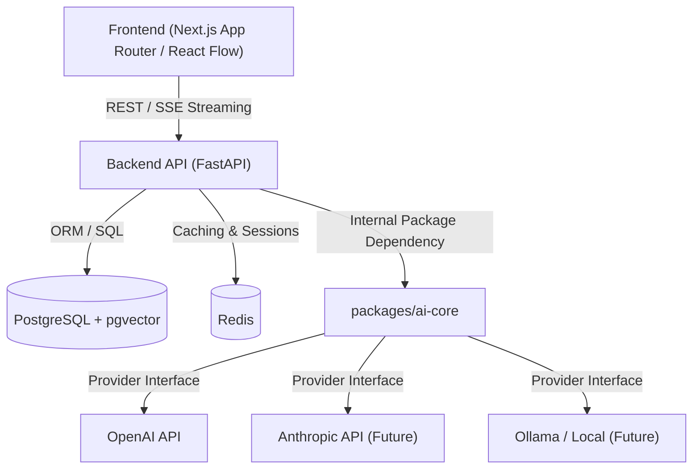
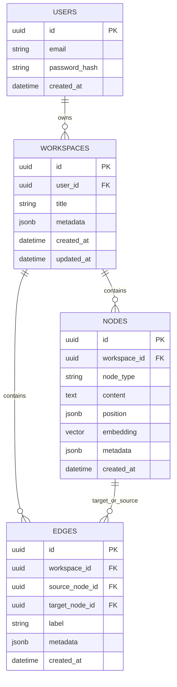
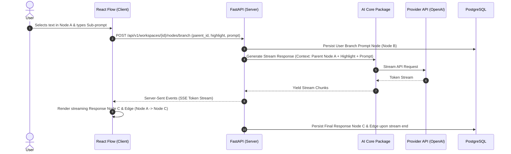

# System Architecture — GraphMind

---

## 1. Architectural Principles & Overview

GraphMind is designed as a **Modular Monolith** housed within a monorepo. It prioritizes simplicity, clean separation of concerns, high observability, and strict interface boundaries.



---

## 2. Monorepo Repository Structure

```
GraphMind/
├── apps/
│   ├── web/               # Next.js 15 App Router Frontend (TypeScript, React Flow, Zustand)
│   └── api/               # FastAPI Backend (Python 3.12+, uv package manager)
├── packages/
│   ├── ai-core/           # Provider-agnostic LLM, Agent, Memory, and Chain abstractions
│   └── shared/            # Shared TypeScript types, schemas, and API contracts
├── docs/                  # System documentation, PRD, Manifesto, ADRs, Roadmap
├── docker/                # Dockerfiles and container scripts
├── docker-compose.yml     # Local orchestration (PostgreSQL, Redis, API, Web)
├── pnpm-workspace.yaml    # Workspace configuration for JS/TS packages
├── pyproject.toml         # Python root workspace configuration
└── README.md
```

---

## 3. Component Details & Technology Stack

### 3.1 Frontend (`apps/web`)
- **Framework**: Next.js (App Router, Server Components where applicable, Client Components for canvas).
- **Language**: TypeScript (strict mode enabled).
- **State Management**: 
  - `Zustand`: Client-side state (canvas graph nodes, active selection, UI viewport, active tools).
  - `TanStack Query (React Query)`: Server state management, data fetching, caching, and mutation lifecycle.
- **Graph Visualization**: `React Flow` (`@xyflow/react`) for canvas rendering, drag-and-drop nodes, custom node types, edge rendering, and auto-layout integrations.
- **Styling & UI**: Tailwind CSS + `shadcn/ui` (Radix primitives), minimal clean aesthetic.
- **Form & Validation**: `React Hook Form` + `Zod`.

### 3.2 Backend (`apps/api`)
- **Language**: Python 3.12+ (managed with `uv`).
- **Framework**: FastAPI (async routes, automatic OpenAPI documentation, Pydantic v2 validation).
- **Database & ORM**: SQLAlchemy 2.0 (async engine) + `Alembic` for migrations.
- **Database Engine**: PostgreSQL 16+ with `pgvector` extension for vector embeddings.
- **Cache & Pub/Sub**: Redis 7+ for session management, token blacklisting, and task queueing.

### 3.3 AI Core Layer (`packages/ai-core`)
`packages/ai-core` is an internal Python package that abstracts all foundation model providers and agent orchestration.

- **Strict Isolation Rule**: `apps/api` **never** imports `openai`, `anthropic`, or `langchain` directly. It only imports from `ai_core`.
- **Abstractions**:
  - `BaseProvider`: Abstract base class specifying `generate()`, `stream()`, `embed()`.
  - `LLMConfig`: Pydantic settings model for model name, temperature, max tokens, system prompts.
  - `BaseAgent`: Interface for stateful execution graphs (wrapping LangGraph or custom execution loops).

```python
# Conceptual AI Core Interface
class BaseProvider(ABC):
    @abstractmethod
    async def generate(self, prompt: str, config: LLMConfig) -> GenerationResult:
        pass

    @abstractmethod
    async def stream(self, prompt: str, config: LLMConfig) -> AsyncIterator[StreamChunk]:
        pass
```

---

## 4. Data Model & Database Schema

The graph structure is stored relationally using a Nodes & Edges model in PostgreSQL:



---

## 5. End-to-End Sequence: Prompt to Branch Node



---

## 6. Observability, Logging & Deployment

- **Containerization**: Single `docker-compose.yml` spins up `api`, `web`, `postgres`, and `redis` for easy local developer onboarding.
- **Log Format**: JSON formatted logs using Python `structlog` in the backend.
- **Configuration**: All configuration loaded via Pydantic `BaseSettings` reading `.env` files.
