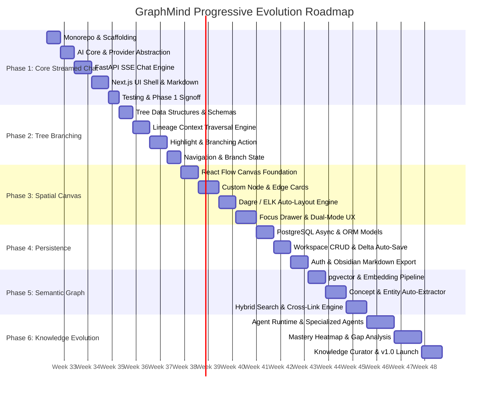

# GraphMind — Master Evolutionary Roadmap & Phase Specifications

> **Philosophy:** *Progressive, organic growth without dead UI or prototype hacks.* Every phase delivers a fully functional, production-grade release that naturally extends the previous phase.

---

## 1. Master Timeline Summary

Assuming a focused pace of **~2 hours/day** (approx. **10 – 14 engineering hours/week**), here is the realistic timeline to build the entire production-grade platform:

| Phase | Phase Name | Focus & Core Deliverable | Estimated Time | Spec Document |
| :--- | :--- | :--- | :--- | :--- |
| **Phase 1** | **Production Core & Streamed Chat** | Provider-agnostic AI Core, FastAPI SSE streaming, Next.js UI shell, Markdown + KaTeX, unit & E2E tests. | **2 – 3 Weeks** (~35 hrs) | [`phase-01-core-chat-engine.md`](./phases/phase-01-core-chat-engine.md) |
| **Phase 2** | **Tree-Structured Branching** | Hierarchical conversation tree, text-highlight branching trigger, context lineage traversal engine. | **2 – 3 Weeks** (~30 hrs) | [`phase-02-tree-branching.md`](./phases/phase-02-tree-branching.md) |
| **Phase 3** | **Spatial Graph Canvas** | 2D React Flow canvas, node cards, Dagre auto-layout, canvas + Focus Drawer dual UX, keyboard shortcuts. | **3 – 4 Weeks** (~45 hrs) | [`phase-03-spatial-graph-canvas.md`](./phases/phase-03-spatial-graph-canvas.md) |
| **Phase 4** | **Workspace Persistence** | PostgreSQL + async SQLAlchemy, Alembic migrations, auth/JWT, auto-save debouncing, Obsidian markdown export. | **2 – 3 Weeks** (~35 hrs) | [`phase-04-persistence-workspaces.md`](./phases/phase-04-persistence-workspaces.md) |
| **Phase 5** | **Semantic Graph & Discovery** | `pgvector` embeddings, background concept extraction, hybrid BM25+vector search, suggested cross-branch links. | **3 – 4 Weeks** (~45 hrs) | [`phase-05-semantic-graph-discovery.md`](./phases/phase-05-semantic-graph-discovery.md) |
| **Phase 6** | **Knowledge Evolution & Agents** | Multi-agent runtime (Research, Quiz, Summarizer), user mastery modeling, Knowledge Curator, v1.0 release. | **4 – 5 Weeks** (~55 hrs) | [`phase-06-multi-agent-knowledge-evolution.md`](./phases/phase-06-multi-agent-knowledge-evolution.md) |

**Total Estimated Duration:** **16 – 22 Weeks** (~4 to 5.5 Months) of structured, production-grade engineering.

---

## 2. Master Gantt Progression

---

## 3. Phase Specifications Index

Read each dedicated specification file for in-depth technical tasks, data flows, and acceptance criteria:

1. [**Phase 1: Production Core & Streamed Chat Engine**](./phases/phase-01-core-chat-engine.md)
2. [**Phase 2: Tree-Structured Branching & Lineage Engine**](./phases/phase-02-tree-branching.md)
3. [**Phase 3: The Spatial Graph Canvas (2D Visual Workspace)**](./phases/phase-03-spatial-graph-canvas.md)
4. [**Phase 4: Workspace Persistence & Relational Storage**](./phases/phase-04-persistence-workspaces.md)
5. [**Phase 5: Semantic Graph & Automated Knowledge Discovery**](./phases/phase-05-semantic-graph-discovery.md)
6. [**Phase 6: Multi-Agent Workflows & Knowledge Evolution**](./phases/phase-06-multi-agent-knowledge-evolution.md)
