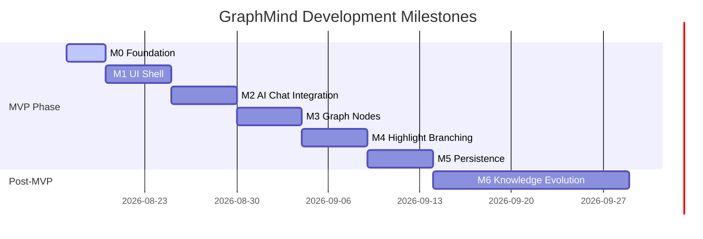

# GraphMind Project Roadmap & Milestones

---

## Roadmap Overview

Development follows an **incremental, milestone-driven execution model**. Every milestone represents a self-contained, releasable slice of functionality. Ideas beyond the active milestone are explicitly scheduled into future milestones to prevent scope creep.

---

## Milestone 0: Repository Foundation (M0)

**Goal**: Establish monorepo structure, development tooling, CI/CD linting, and basic server containers.

### Scope & Tasks
- [ ] Monorepo structure setup (`apps/web`, `apps/api`, `packages/ai-core`, `packages/shared`).
- [ ] Package manager configurations (`pnpm-workspace.yaml`, `pyproject.toml` with `uv`).
- [ ] Backend foundation: FastAPI application skeleton, health check route, CORS, structlog logging.
- [ ] Frontend foundation: Next.js 15 App Router setup, Tailwind CSS, shadcn/ui initialization.
- [ ] Database containers: `docker-compose.yml` with PostgreSQL 16 (+ `pgvector`) and Redis.
- [ ] Linting & formatting setup (Ruff, MyPy, Black for Python; ESLint, Prettier for TypeScript).

### Exit Criteria
- `docker-compose up` cleanly starts Web, API, Postgres, and Redis containers.
- `/healthz` API endpoint returns `200 OK`.
- Both frontend and backend linting checks pass cleanly.

---

## Milestone 1: UI Shell & Canvas Scaffold (M1)

**Goal**: Build a responsive visual canvas shell with React Flow and sidebar navigation.

### Scope & Tasks
- [ ] React Flow canvas layout integration in `apps/web`.
- [ ] Workspace layout shell (sidebar, canvas viewport, top bar).
- [ ] Custom initial canvas controls (zoom, pan, minimap, reset layout button).
- [ ] Zustand store for graph state (nodes, edges, active selection).
- [ ] Static dummy nodes to verify dragging, positioning, and rendering performance.

### Exit Criteria
- Canvas renders at 60 FPS with custom styled React Flow nodes.
- User can pan, zoom, drag nodes, and inspect dummy node details.

---

## Milestone 2: AI Chat Integration & Provider Abstraction (M2)

**Goal**: Implement `packages/ai-core` provider interface and streaming responses in the backend.

### Scope & Tasks
- [ ] Build `packages/ai-core` interface (`BaseProvider`, `LLMConfig`, `StreamChunk`).
- [ ] Implement OpenAI provider module inside `packages/ai-core`.
- [ ] Add FastAPI SSE (Server-Sent Events) endpoint `/api/v1/chat/stream`.
- [ ] Connect prompt input bar to the backend streaming endpoint.
- [ ] Display streaming markdown tokens in real time in the UI.

### Exit Criteria
- User can enter a prompt and view streaming Markdown responses.
- Application code relies strictly on `ai-core` abstractions without direct OpenAI SDK dependencies in `apps/api`.

---

## Milestone 3: Graph Node Transformation (M3)

**Goal**: Convert prompt/response interactions directly into dynamic React Flow graph nodes.

### Scope & Tasks
- [ ] Define backend Node and Edge Pydantic schemas and database ORM models.
- [ ] Implement automatic graph node generation: Prompt -> Root Node; AI Answer -> Response Node.
- [ ] Connect parent-child directed edges (`Root -> Response`).
- [ ] Implement auto-layout helper (Dagre / ELK algorithm) to arrange newly generated nodes cleanly.

### Exit Criteria
- Asking a question dynamically appends an interactive, formatted node to the canvas graph with a connected directed edge.

---

## Milestone 4: Highlight-to-Branch Interaction (M4)

**Goal**: Enable contextual branching by selecting text inside any response node.

### Scope & Tasks
- [ ] Custom Markdown node renderer with text selection listener.
- [ ] Contextual popover pill ("Branch from selection") upon text highlight.
- [ ] Sub-prompt modal passing highlighted snippet as context.
- [ ] Backend prompt builder merging parent node context + highlight snippet + sub-prompt.
- [ ] Render child branch node linked to the highlighted parent node.

### Exit Criteria
- User can highlight any sentence in a node, click "Branch", type a sub-question, and spawn a child branch linked to that specific concept.

---

## Milestone 5: Workspace Persistence & Auth (M5)

**Goal**: Persist workspace graphs, node layouts, and history to PostgreSQL, with secure authentication.

### Scope & Tasks
- [ ] User Auth API: Email/Password signup/login + OAuth2 integration (Google/GitHub).
- [ ] JWT authentication middleware in FastAPI.
- [ ] Database persistence for workspaces, nodes, edges, and viewport layouts.
- [ ] Workspace sidebar: list workspaces, create workspace, load workspace state.
- [ ] Auto-save graph mutations to PostgreSQL.

### Exit Criteria
- User can log in, create a workspace, build a graph, reload the browser, and resume from the exact state.

---

## Milestone 6: Knowledge Evolution (Post-MVP / Future)

**Goal**: AI-driven concept extraction, user knowledge mapping, and graph-to-graph synthesis.

### Scope & Tasks
- [ ] Automated concept entity extraction using `pgvector` embeddings.
- [ ] Semantic link recommendations between distant graph nodes.
- [ ] User knowledge state tracking (mastered topics vs exploration targets).
